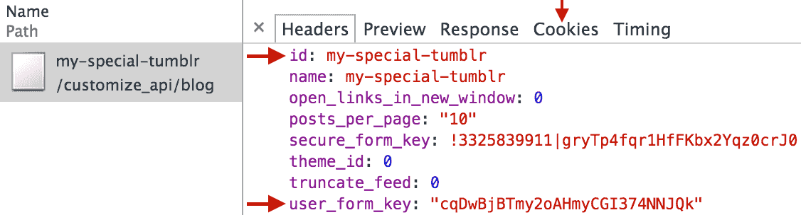

# upload 

> Upload your Tumblr theme via node or CLI

Until now the only way to upload your custom theme to Tumblr was through their website, **manually**, by copying and pasting it into a form.

`tumblr-upload` lets you upload your theme via command line or in a node application (like `gulp`) using your Tumblr cookies as credentials.

<!-- START doctoc generated TOC please keep comment here to allow auto update -->
<!-- DON'T EDIT THIS SECTION, INSTEAD RE-RUN doctoc TO UPDATE -->
**Table of Contents**

- [Install](#install)
- [Setup](#setup)
  - [Getting your credentials](#getting-your-credentials)
  - [Using your credentials](#using-your-credentials)
    - [Sample `tumblr-upload.yml`](#sample-tumblr-uploadyml)
- [Usage](#usage)
  - [With `tumblr-upload.yml` project file](#with-tumblr-uploadyml-project-file)
  - [With credentials passed as an argument](#with-credentials-passed-as-an-argument)
- [API](#api)
  - [tumblrUpload(htmlTemplate, callback)](#tumblruploadhtmltemplate-callback)
  - [new tumblrUpload.Blog(credentials)](#new-tumblruploadblogcredentials)
- [CLI](#cli)
  - [CLI examples](#cli-examples)
  - [Options](#options)
- [Legal](#legal)

<!-- END doctoc generated TOC please keep comment here to allow auto update -->


## Install

```
$ npm install --save tumblr-upload
```

## Setup

`tumblr-upload` simulates the press of the Save button in their backend, so it needs your own valid and current cookies. The cookie recovery process only takes a minute and it has to be done just once (per blog).

### Getting your credentials

Cookies will be invalidated on logout, so it's suggested to do the following in an incognito window and to close it afterwards without logging out. Chrome was used for these steps:

1. Go to edit your Tumblr theme
	1. Log into Tumblr
	2. Select your blog
	3. Open **Customize**
	3. Open **Edit HTML >**
2. **Save** your theme with your developer tools open
	4. Type anything to enable the **Update preview** button
	5. Press the **Update preview** button
	6. Open your browser developer tools
	7. Open the Network tab and enable it if necessary
	8. Press the **Save** button on the site
3. You should see a POST request in the Network tab, select it
4. Scroll to the bottom and copy the values of `id` and `user_form_key`
  
5. Visit the Cookies tab
6. Copy the values of the cookies `anon_id`, `pfe`, `pfp`, `pfs`, and `pfu`

### Using your credentials

You can specify these values [in node](#with-credentials-passed-as-an-argument), [via command line](#cli-examples), or in the `tumblr-upload.yml` file in your project root.

#### Sample `tumblr-upload.yml`

```yml
tumblr_id: my-special-tumblr
user_form_key: cqDwBjBTmy2oQHmyCFI574NNJQk
anon_id: HTWJBOYOABHOFGDSLQIXNISORNJCVXSZ
pfe: 1433542234
pfp: ihx7GPOIpOm1YoVN1Np7awxBmbXdsz4rHDFPn6z4
pfs: SpfJuvtJ5jxoDqCQ7qF1wA5mVdw
pfu: 5252888
```


## Usage

### With `tumblr-upload.yml` project file

```js
var tumblrUpload = require('tumblr-upload');
var fs = require('fs');
var template = fs.readFileSync('index.tumblr.html', 'utf8');

tumblrUpload(template, function (err) {
	if (err) {
		console.error(err);
		return;
	}
	console.log('Uploaded!');
});
```

### With credentials passed as an argument

```js
var tumblrUpload = require('tumblr-upload');
var fs = require('fs');
var template = fs.readFileSync('index.tumblr.html', 'utf8');

var production = new tumblrUpload.Blog({
	tumblr_id: 'my-special-tumblr',
	user_form_key: 'cqDwBjBTmy2oQHmyCFI574NNJQk',
	anon_id: 'HTWJBOYOBBHOFGDSQQIXNISORNJCVXSZ',
	pfe: '1423532234',
	pfp: 'ihx7GPOIpOm1YoVN1Rq7awxBfbXdsz4rHDFPe6z4',
	pfs: 'SffJuvtJ5jxorRqCQ7qF1wT5mVdw',
	pfu: '5258845',
});

production.upload(template, function (err) {
	if (err) {
		console.error(err);
		return;
	}
	console.log('Uploaded!');
});
```


## API


### tumblrUpload(htmlTemplate, callback)

This will upload the template using the credentials in `tumblr-upload.yml` in your project's root (or cwd).

Returns an [http.ClientRequest object](https://nodejs.org/api/http.html#http_class_http_clientrequest) that can be `.abort()`'ed if necessary.

- `htmlTemplate` - Tumblr template to upload (the actual theme text, not the filename)
- `callback(err)` - Function to call after the upload. `Err` will contain the error message, or it will be undefined if successful.

### new tumblrUpload.Blog(credentials)

Type: `constructor`

- `credentials` - Object or array previously-saved credentials. If array, follow this order: `tumblr_id`, `user_form_key`, `anon_id`, `pfe`, `pfp`, `pfs`, `pfu`

Returns an object with:

* `upload` *(function)* - Same as the [`tumblrUpload()`](#tumblruploadhtmltemplate-callback) function but will use the credentials provided in `.Blog(…)`


## CLI

```
$ npm install --global tumblr-upload
```

### CLI examples

```sh
# Basic usage, will use tumblr-upload.yml
tumblr-upload index.tumblr.html

# Provide credentials on the fly, without relying on separate files
# Must be in the following order: tumblr_id,user_form_key,anon_id,pfe,pfp,pfs,pfu
tumblr-upload --credentials my-special-tumblr,cqDwBjBTmy2oQHmyCFI574NNJQk,HTWJBOYOBBHOFGDSQQIXNISORNJCVXSZ,1423532234,ihx7GPOIpOm1YoVN1Rq7awxBfbXdsz4rHDFPe6z4,SffJuvtJ5jxorRqCQ7qF1wT5mVdw,5258845 index.tumblr.html
```

### Options

**`--credentials`**

Specify comma-separed credentials, without spaces, in this order: tumblr_id,user_form_key,anon_id,pfe,pfp,pfs,pfu

**`--help`**

Show help screen

## Legal

License: MIT © [Federico Brigante](https://twitter.com/bfred_it)

Tumblr trademarks belong to [Tumblr, Inc](https://www.tumblr.com/)

tumblr-upload is NOT affiliated with, endorsed, or sponsored by Tumblr.

